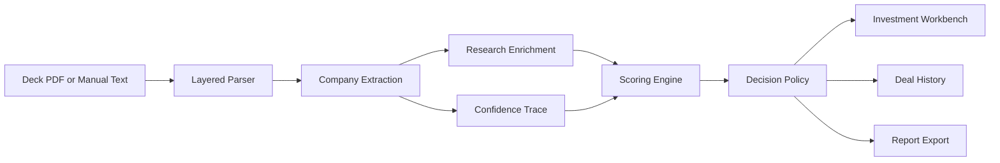

Technical Sample

# Deal Screener

An AI-native deal intelligence workbench that converts unstructured pitch decks into source-aware investment memos, scoring rationale, and partner-ready recommendations.

**Stack:** Python, Streamlit, Groq-hosted LLMs, Llama 4 Vision, PyMuPDF, DuckDuckGo, Google Trends, local JSON storage.

---

Problem

# Early deal review is high-volume and evidence-poor

<strong>Analyst bottleneck</strong> 
Decks arrive faster than teams can parse, summarize, and compare them.

<strong>Inconsistent artifacts</strong> 
Slides mix text, images, screenshots, and ambiguous claims.

<strong>Subjective scoring</strong> 
First-pass recommendations vary by reviewer and context window.

<strong>Weak audit trail</strong> 
Investment claims often lack structured evidence and confidence markers.

---

Product

# From pitch deck to investment memo

1. Upload a PDF or paste deck text.
2. Extract company, team, market, traction, product, and deal terms.
3. Enrich with public web and trends context.
4. Score the company against a configurable fund thesis.
5. Produce a recommendation, executive memo, diligence questions, and optional decline communication.
6. Save the record for historical pipeline analytics.

---

Architecture

# Screening pipeline

The pipeline is intentionally modular so each stage can become a specialized agent or independent service.

---

Implementation

# Current technical depth

| Layer | Implementation |
|---|---|
| Interface | Streamlit multipage workbench with professional cards, tabs, and analytics |
| Parsing | PyMuPDF text, blocks, spans, and Llama 4 Vision fallback |
| Extraction | Structured LLM prompt for company, team, market, traction, risks, and confidence |
| Enrichment | DuckDuckGo web search and Google Trends sector momentum |
| Scoring | Weighted six-factor framework with configurable thresholds |
| Storage | Local JSON deal archive for rapid prototyping |

---

Scoring

# Investment decision framework

| Criterion | Weight | Signal |
|---|---:|---|
| Team | 25% | Founder-market fit, domain expertise, completeness |
| Market | 20% | TAM, growth, timing, category pressure |
| Traction | 20% | Revenue, users, retention, customer quality |
| Product | 15% | Differentiation, defensibility, PMF evidence |
| Thesis Fit | 10% | Alignment with fund stage, sector, geography |
| Deal Terms | 10% | Valuation, round structure, ownership potential |

Decision policy: **Fast Track** at 7.5+, **Review** at 5.0-7.4, **Pass** below 5.0.

---

Open-Source Inspiration

# What stronger AI products do well

<strong>Dify-style workflows</strong> 
Visual, inspectable steps with model, prompt, latency, and logs per node.

<strong>LangGraph-style state</strong> 
Graph execution, human review gates, retries, and persistent checkpoints.

<strong>Kotaemon-style evidence</strong> 
Source citations, PDF highlights, low-confidence warnings, and retrieval traces.

<strong>OpenBB-style data layer</strong> 
Standardized connectors that make public and proprietary data reusable.

---

Design Upgrade

# Professional workbench experience

The UI now moves away from playful emoji labels and toward an enterprise analytics aesthetic:

- high-contrast dark navigation,
- clear hero sections,
- decision cards with semantic color rather than icons,
- score cards with progress bars,
- a visible pipeline trace,
- tabbed memo, extraction, research, confidence, and communication views,
- deal history analytics for pipeline review.

---

Reliability

# Guardrails already in place

- Manual text fallback when PDF extraction fails.
- Multiple PDF extraction strategies before using vision models.
- Model rotation across Groq-hosted models for rate limits and failures.
- Score parsing fallbacks: strict regex, JSON block, permissive labels, and weighted composite calculation.
- Configurable fund thesis, scoring weights, and decision thresholds.
- Confidence trace for key extracted fields.

---

Next Build Phase

# Make it sophisticated

1. Refactor orchestration into a graph of specialist diligence agents.
2. Store structured JSON claims with slide or URL evidence.
3. Add PDF preview with highlighted source snippets.
4. Add a benchmark dataset for extraction accuracy and score stability.
5. Replace local JSON with SQLite or Postgres.
6. Add FastAPI endpoints for programmatic screening.
7. Add observability: token cost, latency, model used, retry count, and failure reason.

---

Differentiation

# Why this is more than an LLM wrapper

1
<strong>Workflow depth</strong> Document AI, enrichment, scoring, memo generation, and archive.

2
<strong>Investment framing</strong> Outputs are designed around venture analyst and partner workflows.

3
<strong>Explainability path</strong> Confidence traces create a foundation for source-grounded diligence.

4
<strong>Extensible architecture</strong> Each stage can become a specialized agent, tool, or service.

---

Talk Track

# Suggested 3-minute walkthrough

1. **Problem:** early-stage teams need faster, more consistent first-pass review.
2. **Demo:** upload deck, inspect pipeline, review scorecard, open investment memo.
3. **Engineering:** explain layered parsing, prompt structure, enrichment, score extraction, and thresholds.
4. **Trust:** show confidence trace and discuss source-grounded next phase.
5. **Roadmap:** describe graph agents, evidence citations, evals, and persistent data layer.
